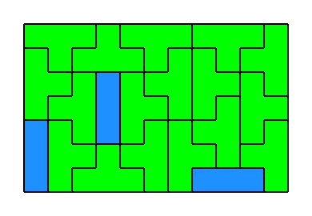
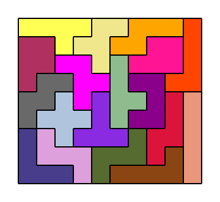

# Tiler

Tiler is a CLI tool for automated solving of [polyomino](https://en.wikipedia.org/wiki/Polyomino)
tiling problems. It features multiple solver backends.

## Usage

The CLI takes input (either from command-line or from a file) which defines a board (region
consisting of unit squares) and polyomino tiles and tries to find a perfect tiling of the board with
the tiles.

The shape of the board as well as of each tile can be provided in any of these formats:

- **name**, eg. `3L` (see the `list` command for the list of all named shapes)

- **dimensions**, eg. `2x4` (applicable only for rectangles)

- **map**, eg. this equivalent of `3x2`:

  ```txt
  xxx
  xxx
  ```

  (useful with the `-f` option)

- **perimeter**, eg. `DDRRULUL` - an equivalent of `3L` (crossings of the perimeter are not allowed,
  applicable only for shapes without holes)

You should provide a list of shapes, where the first one represents the board and the others the
tiles. Tile shape may be prefixed with `N:` where `N` is the available number of such tiles
(unlimited if not provided). See the `example` command for input examples.

Run `tiler -h` and `tiler solve -h` to see all options.

### Limitations

Only continuous shapes are allowed.

The solver may rotate the tiles. There is a CLI flag to allow reflections (flipping the tiles over).

## Examples

Here are some example outputs of the solver.

`tiler solve -s 01.svg 11x7 4T 3:3I`\


`tiler solve -s 02.svg 10x9 1:5A 1:5F 1:5G 1:5J 1:5P 1:5S 1:5Y 1:5R 1:5N 1:5L 1:5Q 1:5Z 1:5I 1:5T 1:5U 1:5V 1:5W 1:5X`\


## Build Instructions

Building Tiler requires these dependencies:

- [CMake](https://cmake.org/) build tool (version 3.12 or later)
- [Conan](https://conan.io/) package manager
- a C/C++ compiler (a recent version of GCC is recommended, C++17 support is required)

Build the exacutable by running `./scripts/release-setup.sh` and `./scripts/release-build.sh`. You
can configure build options using eg. `ccmake` before running `release-build.sh` or by adding
appropriate `-D` flags to the `cmake ..` line in `release-setup.sh`.

If you want to use SAT solvers [CaDiCaL](https://github.com/arminbiere/cadical) and/or
[CryptoMiniSat](https://github.com/msoos/cryptominisat), run `./scripts/build-cadical.sh` and
`./scripts/build-cryptominisat.sh` beforehand (or having them installed system-wide should work as
well). Otherwise, you need to set CMake options `-DCADICAL=OFF` and `-DCRYPTOMINISAT=OFF`.

Your freshly compiled Tiler executable will be located at `release/bin/tiler`.

This setup is tested on Linux with GCC 10.2.0, but it should work on other platforms, too (maybe
with some minor tweaks).

## Development Setup

In addition to CMake and Conan (see [Build Instructions](#build-instructions)), you should install:

- [ClangFormat](https://clang.llvm.org/docs/ClangFormat.html) code formatter (version 10 or later)
- [Cppcheck](http://cppcheck.sourceforge.net/) static code analysis tool
- [GDB](https://www.gnu.org/software/gdb/) debugger (optional)
- [Python 3](https://www.python.org/), [Pandas](https://pandas.pydata.org/) and
  [Matplotlib](https://matplotlib.org/) (if you want to run the benchmark displaying script)

Regarding the actual development, using [VS Code](https://code.visualstudio.com/) with the [C/C++
extension](https://marketplace.visualstudio.com/items?itemName=ms-vscode.cpptools) is recommended -
this way, you can use the IDE tasks, the built-in debugging UI and utilize the proposed [VS Code
settings](./.vscode/example.settings.json). If you intend to use a different editor/IDE, all
commands to run can be found at [tasks.json](./.vscode/tasks.json).

## Benchmarks

To run the benchmarking suite on all problems in the `problems` directory, run
`./scripts/release-benchmark.sh` (however, note that this will take several hours; you can edit the
`benchmark_filter` parameter in the script to select only some problems or solvers). You can use
`./benchmark/show.py` to plot the measured data.

## Problems

The `problems` directory contains several tiling problems for testing and benchmarking. They are
organized by their tile sets, and their filenames try to describe the respective problems (e.g. they
usually contain board dimensions as a measure of the problem size). Each filename ends with either
`_s`, if it is solvable, or `_u`, if it is unsolvable. If the problem is intended to be solved with
reflections allowed, its filename contains a quote `'`.

The following books were used as sources of some problems:

> S. W. Golomb. *Polyominoes: Puzzles, patterns, problems, and packings*. Princeton University Press,
2nd edition, 1994.

```txt
many-unique-tiles/4r-5r-04x20'_s
many-unique-tiles/4r-5r-05x16'_s
many-unique-tiles/4r-5r-08x10'_s
many-unique-tiles/5r-03x20'_s
many-unique-tiles/5r-04x15'_s
many-unique-tiles/5r-05x12'_s
many-unique-tiles/5r-06x10'_s
many-unique-tiles/5r-diamond'_u
many-unique-tiles/5r-fcr'_s
many-unique-tiles/5r-H-08x09'_s
many-unique-tiles/5r-hskew-06x10'_u
many-unique-tiles/5r-plus'_u
many-unique-tiles/5r-sideways'_u
many-unique-tiles/5r-skew-03x20'_s
many-unique-tiles/5r-skew-04x15'_s
many-unique-tiles/5r-skew-05x12'_s
many-unique-tiles/5r-skew-06x10'_s
```

> G. E. Martin. *Polyominoes: a Guide to Puzzles and Problems in Tiling*. Mathematical Association of
America, 1991.

```txt
4I/06x06_u
mixed-tiles/1-3I-07x07_s
mixed-tiles/4O-4T-06x06_u
```

The remaining problems are either modifications of the listed ones, trivial, generally-known, or
genuine.

---

## License

Tiler is licensed under the [GNU GPL license v3](./LICENSE).

```txt
Tiler - tool for automated solving of polyomino tiling problems
Copyright (C) 2020  David Misiak

This program is free software: you can redistribute it and/or modify
it under the terms of the GNU General Public License as published by
the Free Software Foundation, either version 3 of the License, or
(at your option) any later version.

This program is distributed in the hope that it will be useful,
but WITHOUT ANY WARRANTY; without even the implied warranty of
MERCHANTABILITY or FITNESS FOR A PARTICULAR PURPOSE.  See the
GNU General Public License for more details.

You should have received a copy of the GNU General Public License
along with this program.  If not, see <http://www.gnu.org/licenses/>.
```
